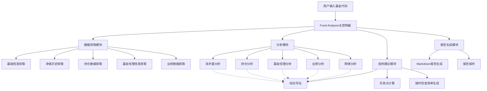
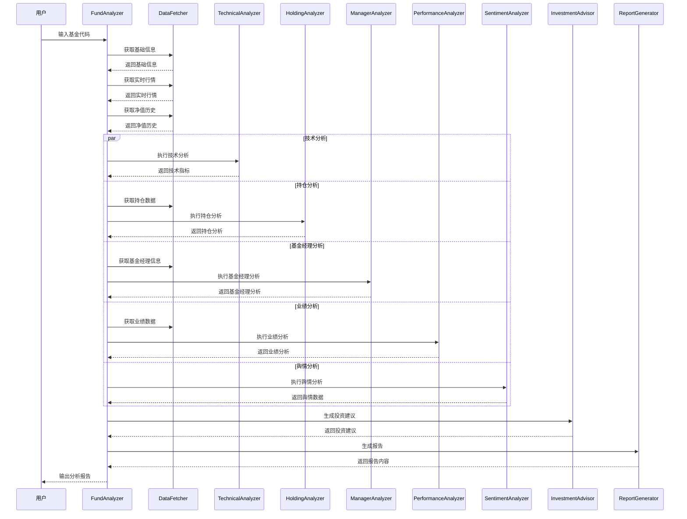
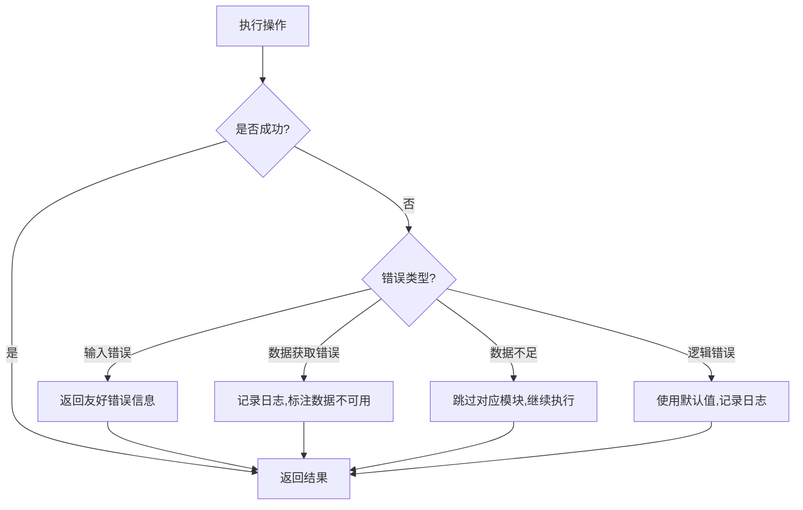

# 基金分析技能设计文档

## 概述

本设计文档详细描述了基金分析技能的技术架构、组件设计、数据模型和实现方案。该技能通过整合蛋卷基金API数据源,结合多维度分析算法,为用户提供专业的基金投资建议。

## 技术选型

### 编程语言
- **Python 3.8+**: 主要开发语言,具有丰富的数据处理和机器学习库

### 主要依赖库
- **pysnowball**: 从雪球网API获取基金数据
- **pandas**: 数据处理和分析
- **numpy**: 数值计算
- **requests**: HTTP请求
- **markdown**: Markdown格式输出
- **logging**: 日志记录

### 数据源
- **蛋卷基金API** (通过pysnowball): 基金基本信息、净值历史、持仓数据、业绩数据等
- 预留扩展: 雪球网新闻API、东方财富数据等

## 架构设计

### 系统架构图



### 模块职责

#### 1. Fund Analyzer (主控制器)
- 协调各模块执行分析流程
- 管理分析状态和进度
- 处理错误和异常
- 生成最终报告

#### 2. Data Fetcher (数据获取模块)
- 从蛋卷基金API获取基金基础信息
- 获取净值历史数据
- 获取持仓数据
- 获取基金经理信息
- 获取业绩数据
- 数据缓存和去重

#### 3. Technical Analyzer (技术面分析模块)
- 计算移动平均线(MA5, MA10, MA20, MA60)
- 判断多头/空头排列
- 识别技术信号(突破/破位)
- 计算趋势和波动率
- 计算RSI、MACD等技术指标

#### 4. Holding Analyzer (持仓分析模块)
- 分析前十大重仓股
- 计算行业集中度
- 计算持仓集中度
- 判断持仓风格(价值/成长/平衡)

#### 5. Manager Analyzer (基金经理分析模块)
- 分析基金经理经验
- 计算管理业绩
- 评估基金经理稳定性

#### 6. Performance Analyzer (业绩分析模块)
- 计算各时间段收益率
- 计算年化收益率
- 计算最大回撤
- 对比同类基金表现
- 对比基准指数表现

#### 7. Sentiment Analyzer (舆情分析模块)
- 搜索相关新闻
- 分析新闻情绪倾向
- 计算综合舆情得分
- 提取关键词

#### 8. Investment Advisor (投资建议模块)
- 综合评估各方面因素
- 生成核心结论
- 计算买卖点位
- 生成操作检查清单

#### 9. Report Generator (报告生成模块)
- 生成Markdown格式报告
- 格式化输出内容
- 保存报告文件

## 组件和接口设计

### 数据模型

#### FundBasicInfo (基金基础信息)
```python
class FundBasicInfo:
    fund_code: str          # 基金代码
    fund_name: str          # 基金名称
    fund_type: str          # 基金类型
    fund_scale: float       # 基金规模(亿元)
    establish_date: str     # 成立日期
    manager_name: str       # 基金经理姓名
    company: str            # 基金公司
```

#### FundRealtimeQuote (实时行情)
```python
class FundRealtimeQuote:
    fund_code: str          # 基金代码
    nav: float              # 当前净值
    change_pct: float       # 日涨跌幅(%)
    day7_return: float      # 近7日年化收益率(%)
```

#### FundNavHistory (净值历史)
```python
class FundNavHistory:
    fund_code: str
    dates: List[str]        # 日期列表
    navs: List[float]       # 净值列表
```

#### TechnicalIndicators (技术指标)
```python
class TechnicalIndicators:
    ma5: float              # 5日均线
    ma10: float             # 10日均线
    ma20: float             # 20日均线
    ma60: float             # 60日均线
    trend: str              # 趋势: "上升", "下降", "震荡"
    formation: str          # 形态: "多头排列", "空头排列", "无明确形态"
    signals: List[str]      # 技术信号列表
    return_30d: float       # 30天收益率
    return_60d: float       # 60天收益率
    return_90d: float       # 90天收益率
```

#### HoldingData (持仓数据)
```python
class HoldingStock:
    stock_name: str         # 股票名称
    stock_code: str         # 股票代码
    holding_ratio: float    # 持仓比例(%)
    holding_value: float    # 持仓市值(亿元)

class HoldingAnalysis:
    top10_holdings: List[HoldingStock]
    industry_concentration: Dict[str, float]  # 行业集中度
    holding_concentration: float              # 前10大持仓占比
    style: str                                 # 持仓风格
```

#### ManagerInfo (基金经理信息)
```python
class ManagerInfo:
    manager_name: str       # 姓名
    experience_years: int   # 从业年限
    manage_years: int      # 管理该基金年限
    fund_count: int        # 管理基金数量
    avg_return: float      # 平均收益率
    max_drawdown: float    # 最大回撤
    is_senior: bool        # 是否资深
```

#### PerformanceData (业绩数据)
```python
class PerformanceData:
    return_1m: float        # 1月收益率
    return_3m: float        # 3月收益率
    return_6m: float        # 6月收益率
    return_1y: float        # 1年收益率
    return_3y: float        # 3年收益率
    return_5y: float        # 5年收益率
    annualized_return: float # 年化收益率
    max_drawdown: float     # 最大回撤
    rank_percentile: float  # 同类排名百分位
    excess_return: float    # 超额收益
```

#### SentimentData (舆情数据)
```python
class NewsItem:
    title: str             # 标题
    summary: str           # 摘要
    sentiment: str         # 情绪: "正面", "负面", "中性"
    date: str             # 日期

class SentimentData:
    score: float           # 综合得分(0-100)
    level: str            # 情绪等级: "强烈正面", "正面", "中性", "负面", "强烈负面"
    news_count: int        # 新闻数量
    news_items: List[NewsItem]
    keywords: List[str]    # 关键词
```

#### InvestmentAdvice (投资建议)
```python
class InvestmentAdvice:
    conclusion: str        # 核心结论(一句话)
    action: str           # 操作建议: "买入", "持有", "卖出", "观望"
    ideal_buy: str        # 理想买点区间
    secondary_buy: str    # 次要买点区间
    stop_loss: str        # 止损位
    take_profit: str      # 止盈位
    checklist: List[str]  # 操作检查清单
```

### 接口设计

#### DataFetcher接口
```python
class DataFetcher:
    def fetch_basic_info(self, fund_code: str) -> FundBasicInfo:
        """获取基金基础信息"""
        pass

    def fetch_realtime_quote(self, fund_code: str) -> FundRealtimeQuote:
        """获取实时行情"""
        pass

    def fetch_nav_history(self, fund_code: str, days: int = 365) -> FundNavHistory:
        """获取净值历史"""
        pass

    def fetch_holdings(self, fund_code: str) -> HoldingAnalysis:
        """获取持仓分析"""
        pass

    def fetch_manager_info(self, fund_code: str) -> ManagerInfo:
        """获取基金经理信息"""
        pass

    def fetch_performance(self, fund_code: str) -> PerformanceData:
        """获取业绩数据"""
        pass
```

#### TechnicalAnalyzer接口
```python
class TechnicalAnalyzer:
    def analyze(self, nav_history: FundNavHistory, current_nav: float) -> TechnicalIndicators:
        """执行技术分析"""
        pass

    def calculate_ma(self, prices: List[float], period: int) -> float:
        """计算移动平均线"""
        pass

    def check_formation(self, ma5: float, ma10: float, ma20: float, ma60: float) -> str:
        """判断多空排列"""
        pass

    def detect_signals(self, current_price: float, ma_values: Dict[str, float]) -> List[str]:
        """检测技术信号"""
        pass
```

#### SentimentAnalyzer接口
```python
class SentimentAnalyzer:
    def analyze(self, fund_code: str, fund_name: str) -> SentimentData:
        """执行舆情分析"""
        pass

    def search_news(self, query: str) -> List[NewsItem]:
        """搜索新闻"""
        pass

    def analyze_sentiment(self, news_items: List[NewsItem]) -> Tuple[float, str]:
        """分析情绪"""
        pass

    def extract_keywords(self, news_items: List[NewsItem]) -> List[str]:
        """提取关键词"""
        pass
```

#### InvestmentAdvisor接口
```python
class InvestmentAdvisor:
    def generate_advice(
        self,
        technical: TechnicalIndicators,
        holding: HoldingAnalysis,
        manager: ManagerInfo,
        performance: PerformanceData,
        sentiment: SentimentData
    ) -> InvestmentAdvice:
        """生成投资建议"""
        pass

    def generate_checklist(self) -> List[str]:
        """生成操作检查清单"""
        pass

    def calculate_price_points(
        self,
        current_nav: float,
        volatility: float,
        technical: TechnicalIndicators
    ) -> Dict[str, str]:
        """计算买卖点位"""
        pass
```

#### ReportGenerator接口
```python
class ReportGenerator:
    def generate(
        self,
        fund_code: str,
        basic_info: FundBasicInfo,
        quote: FundRealtimeQuote,
        technical: TechnicalIndicators,
        holding: HoldingAnalysis,
        manager: ManagerInfo,
        performance: PerformanceData,
        sentiment: SentimentData,
        advice: InvestmentAdvice
    ) -> str:
        """生成Markdown报告"""
        pass

    def save_report(self, report: str, filename: str) -> str:
        """保存报告"""
        pass
```

## 数据流设计

### 主分析流程



## 算法设计

### 技术分析算法

#### 移动平均线计算
```python
def calculate_ma(prices: List[float], period: int) -> float:
    """
    计算简单移动平均线
    MA = (P1 + P2 + ... + Pn) / n
    """
    if len(prices) < period:
        raise ValueError(f"数据不足,至少需要{period}个数据点")
    return sum(prices[-period:]) / period
```

#### 多头/空头排列判断
```python
def check_formation(ma5: float, ma10: float, ma20: float, ma60: float) -> str:
    """
    判断多空排列
    多头排列: MA5 > MA10 > MA20 > MA60
    空头排列: MA5 < MA10 < MA20 < MA60
    """
    if ma5 > ma10 > ma20 > ma60:
        return "多头排列"
    elif ma5 < ma10 < ma20 < ma60:
        return "空头排列"
    else:
        return "无明确形态"
```

#### 技术信号检测
```python
def detect_signals(current_price: float, ma_values: Dict[str, float]) -> List[str]:
    """
    检测技术信号
    """
    signals = []
    ma20 = ma_values.get('ma20')

    # 突破信号
    if current_price > ma20:
        signals.append("向上突破MA20")
    elif current_price < ma20:
        signals.append("向下跌破MA20")

    # 距离MA20的偏离度
    deviation = (current_price - ma20) / ma20 * 100
    if deviation > 3:
        signals.append(f"超买信号(偏离+{deviation:.2f}%)")
    elif deviation < -3:
        signals.append(f"超卖信号(偏离{deviation:.2f}%)")

    return signals
```

### 持仓分析算法

#### 持仓风格判断
```python
def determine_style(holdings: List[HoldingStock]) -> str:
    """
    判断持仓风格
    基于PE、PB和成长性指标
    """
    if not holdings:
        return "未知"

    avg_pe = calculate_avg_pe(holdings)
    avg_pb = calculate_avg_pb(holdings)
    growth_score = calculate_growth_score(holdings)

    if growth_score > 0.7:
        return "成长型"
    elif avg_pe < 15 and avg_pb < 2:
        return "价值型"
    else:
        return "平衡型"
```

### 投资建议生成算法

#### 综合评估得分计算
```python
def calculate_composite_score(
    technical_score: float,  # 技术面得分(0-100)
    fundamental_score: float,  # 基本面得分(0-100)
    sentiment_score: float,  # 舆情得分(0-100)
) -> float:
    """
    计算综合评估得分
    权重: 技术面40%, 基本面40%, 舆情20%
    """
    weights = [0.4, 0.4, 0.2]
    scores = [technical_score, fundamental_score, sentiment_score]

    return sum(s * w for s, w in zip(scores, weights))
```

#### 买卖点位计算
```python
def calculate_price_points(
    current_nav: float,
    volatility: float,
    technical: TechnicalIndicators
) -> Dict[str, str]:
    """
    计算买卖点位
    """
    # 理想买点: 当前价位-1个标准差
    ideal_buy = current_nav * (1 - volatility * 0.5)

    # 止损位: 当前价位-2个标准差
    stop_loss = current_nav * (1 - volatility)

    # 止盈位: 当前价位+3个标准差
    take_profit = current_nav * (1 + volatility * 1.5)

    # 次要买点: 当前价位-1.5个标准差
    secondary_buy = current_nav * (1 - volatility * 0.75)

    return {
        "ideal_buy": f"{ideal_buy:.4f}",
        "secondary_buy": f"{secondary_buy:.4f}",
        "stop_loss": f"{stop_loss:.4f}",
        "take_profit": f"{take_profit:.4f}"
    }
```

## 正确性属性

### 正确性属性说明

*属性是指在系统的所有有效执行中都应该成立的特征或行为——本质上是对系统应该做什么的形式化声明。属性作为人类可读规范和机器可验证的正确性保证之间的桥梁。*

### 基于属性的测试概述

基于属性的测试通过测试许多生成输入上的通用属性来验证软件正确性。每个属性是一个应该对所有有效输入成立的正式规范。

### 核心原则

1. **全称量化**: 每个属性必须包含显式的"for all"语句
2. **需求可追溯性**: 每个属性必须引用它验证的需求
3. **可执行规范**: 属性必须实现为自动化测试
4. **全面覆盖**: 属性应该覆盖所有可测试的验收标准

### 常见属性模式

1. **不变量**: 变换后保持不变的属性
2. **往返属性**: 组合操作及其逆操作返回原始值
3. **幂等性**: 执行两次等于执行一次
4. **变形属性**: 两个组件之间的关系
5. **错误条件**: 生成不良输入并确保正确发出错误信号

### 属性创建过程

属性创建遵循以下步骤:
1. **Prework分析**: 使用prework工具分析每个验收标准
2. **可测试性评估**: 确定每个标准是可测试的属性、示例还是边界情况
3. **属性形式化**: 将可测试标准转换为全称量化属性
4. **需求映射**: 用验证的需求标注每个属性

### 转换EARS为属性

在本节中,你将把EARS验收标准转换为可测试的属性。你将参考你的prework部分来完成此任务。确保逐步解释你的推理过程。

### 验收标准测试Prework

#### 需求1: 基金数据获取
1.1. WHEN 用户输入有效的基金代码,THE Fund_Data_Fetcher SHALL 从蛋卷基金API获取基金基础信息
- **思考**: 这是一个具体的操作,不是通用属性。但可以测试:对于任意有效的基金代码,都应该返回非空的基金基础信息
- **可测试性**: yes - property

1.2. WHEN 用户输入有效的基金代码,THE Fund_Data_Fetcher SHALL 从蛋卷基金API获取基金的实时行情数据
- **思考**: 同上,对于任意有效的基金代码,都应该返回非空的实时行情数据
- **可测试性**: yes - property

1.4. WHEN 用户输入无效的基金代码,THE Fund_Data_Fetcher SHALL 返回清晰的错误信息
- **思考**: 对于任意无效的基金代码(格式错误或不存在),都应该返回错误
- **可测试性**: yes - property

#### 需求2: 技术面分析
2.1. WHEN 基金净值历史数据可用,THE Technical_Analyzer SHALL 计算并分析5日、10日、20日、60日移动平均线
- **思考**: 对于任意至少包含60个数据点的净值序列,都应该能计算出MA5、MA10、MA20、MA60
- **可测试性**: yes - property

2.2. WHEN MA5 > MA10 > MA20 > MA60,THE Technical_Analyzer SHALL 判定为多头排列
- **思考**: 对于任意满足MA5 > MA10 > MA20 > MA60的数据,都应该判定为多头排列
- **可测试性**: yes - property

2.3. WHEN MA5 < MA10 < MA20 < MA60,THE Technical_Analyzer SHALL 判定为空头排列
- **思考**: 对于任意满足MA5 < MA10 < MA20 < MA60的数据,都应该判定为空头排列
- **可测试性**: yes - property

2.6. THE Technical_Analyzer SHALL 计算并显示最近30天、60天、90天的净值涨跌幅
- **思考**: 对于任意净值序列,都应该能计算出30天、60天、90天的涨跌幅
- **可测试性**: yes - property

#### 需求3: 基金持仓分析
3.1. WHEN 基金持仓数据可用,THE Fund_Analyzer SHALL 获取前十大重仓股票列表
- **思考**: 对于任意有效的持仓数据,都应该返回前十大重仓股
- **可测试性**: yes - property

3.2. WHEN 基金持仓数据可用,THE Fund_Analyzer SHALL 计算行业集中度
- **思考**: 对于任意持仓数据,都应该能计算并返回行业集中度
- **可测试性**: yes - property

#### 需求4: 基金经理分析
4.1. WHEN 基金经理数据可用,THE Fund_Analyzer SHALL 获取基金经理的姓名、从业年限、管理该基金的年限
- **思考**: 对于任意有效的基金经理数据,都应该返回完整的基金经理信息
- **可测试性**: yes - property

#### 需求5: 基金业绩分析
5.1. WHEN 基金业绩数据可用,THE Fund_Analyzer SHALL 获取近1月、3月、6月、1年、3年、5年的收益率数据
- **思考**: 对于任意有效的业绩数据,都应该返回各时间段的收益率
- **可测试性**: yes - property

#### 需求6: 舆情情报分析
6.1. WHEN 基金代码输入后,THE Sentiment_Analyzer SHALL 搜索并提取与基金相关的最新新闻标题和摘要,至少5条
- **思考**: 对于任意有效的基金代码,都应该能搜索到至少5条相关新闻
- **可测试性**: yes - property

6.3. WHEN 新闻数据获取成功,THE Sentiment_Analyzer SHALL 计算综合舆情得分(0-100分)
- **思考**: 对于任意新闻列表,都应该能计算出0-100之间的舆情得分
- **可测试性**: yes - property

#### 需求7: 买卖点建议
7.1. WHEN 技术分析、基本面分析和舆情分析完成,THE Investment_Advisor SHALL 基于综合分析生成一句话核心结论
- **思考**: 对于任意完整的分析结果,都应该能生成非空的核心结论
- **可测试性**: yes - property

7.4. THE Investment_Advisor SHALL 根据近期波动幅度计算并显示止盈位
- **思考**: 对于任意当前净值和波动率,都应该能计算止盈位
- **可测试性**: yes - property

#### 需求9: 分析报告生成
9.1. WHEN 所有分析完成,THE Report_Generator SHALL 生成Markdown格式的分析报告
- **思考**: 对于任意完整的分析数据,都应该能生成有效的Markdown格式报告
- **可测试性**: yes - property

9.10. THE Report_Generator SHALL 使用清晰的Markdown格式
- **思考**: 生成的报告应该包含有效的Markdown语法
- **可测试性**: yes - property

### 属性反思

经过对上述prework的反思,我发现一些属性可以合并或优化:

1. **数据获取属性合并**: 需求1中的多个数据获取属性可以合并为"对于任意有效的基金代码,应该能成功获取所有基础数据"
2. **技术分析计算属性**: MA计算、趋势判断等可以合并为更综合的属性
3. **持仓分析属性**: 多个持仓相关属性可以合并
4. **报告生成属性**: 报告格式和内容可以合并验证

### 正确性属性定义

#### 属性 1: 有效基金代码数据获取完整性
*对于任意*有效的基金代码,当调用数据获取接口时,应该能成功获取基金基础信息、实时行情、净值历史、持仓数据和业绩数据
**Validates: Requirements 1.1, 1.2, 1.3, 3.1, 5.1**

#### 属性 2: 无效基金代码错误处理
*对于任意*无效的基金代码(格式错误或不存在),当调用数据获取接口时,应该返回清晰的错误信息而不抛出未处理的异常
**Validates: Requirements 1.4**

#### 属性 3: 移动平均线计算正确性
*对于任意*至少包含60个数据点的净值序列,当计算MA5、MA10、MA20和MA60时,计算结果应该符合移动平均线的数学定义
**Validates: Requirements 2.1**

#### 属性 4: 多头排列判断准确性
*对于任意*满足MA5 > MA10 > MA20 > MA60的净值数据,当执行技术分析时,应该判定为多头排列
**Validates: Requirements 2.2**

#### 属性 5: 空头排列判断准确性
*对于任意*满足MA5 < MA10 < MA20 < MA60的净值数据,当执行技术分析时,应该判定为空头排列
**Validates: Requirements 2.3**

#### 属性 6: 涨跌幅计算准确性
*对于任意*净值序列,当计算最近30天、60天、90天的涨跌幅时,计算结果应该符合涨跌幅的数学定义:(当前值-历史值)/历史值*100%
**Validates: Requirements 2.6**

#### 属性 7: 持仓数据结构完整性
*对于任意*有效的持仓数据,当执行持仓分析时,应该返回包含前十大重仓股、行业集中度和持仓集中度的完整结构
**Validates: Requirements 3.1, 3.2, 3.3**

#### 属性 8: 基金经理信息完整性
*对于任意*有效的基金经理数据,当执行基金经理分析时,应该返回包含姓名、从业年限、管理该基金年限的完整信息
**Validates: Requirements 4.1**

#### 属性 9: 业绩数据完整性
*对于任意*有效的业绩数据,当执行业绩分析时,应该返回各时间段收益率、最大回撤和相对排名的完整数据
**Validates: Requirements 5.1, 5.2, 5.3, 5.4**

#### 属性 10: 舆情得分范围有效性
*对于任意*新闻列表,当执行舆情分析时,计算的综合舆情得分应该在0到100之间
**Validates: Requirements 6.3**

#### 属性 11: 买卖点位计算合理性
*对于任意*当前净值和波动率,当计算买卖点位时,应该满足:止损位 < 次要买点 < 理想买点 < 当前净值 < 止盈位
**Validates: Requirements 7.4, 7.5**

#### 属性 12: 核心结论非空性
*对于任意*完整的技术、基本面和舆情分析结果,当生成投资建议时,核心结论应该是非空字符串
**Validates: Requirements 7.1**

#### 属性 13: 报告格式有效性
*对于任意*完整的分析数据,当生成报告时,输出应该符合有效的Markdown格式语法
**Validates: Requirements 9.1, 9.10**

#### 属性 14: 报告内容完整性
*对于任意*完整的分析数据,当生成报告时,报告应该包含所有必需的章节:基金基本信息、实时行情、技术面分析、持仓分析、基金经理信息、业绩分析、舆情情报和投资建议
**Validates: Requirements 9.2-9.9**

#### 属性 15: 错误处理一致性
*对于任意*错误情况(无效基金代码、网络错误、API错误等),系统都应该返回用户可理解的错误描述,不暴露内部实现细节
**Validates: Requirements 11.1, 11.2, 11.4**

#### 属性 16: 数据往返一致性
*对于任意*获取的净值历史数据,如果将其转换为内部数据结构再转换回来,关键信息(日期、净值)应该保持一致
**Validates: Requirements 1.3**

## 错误处理策略

### 错误分类

#### 1. 数据获取错误
- **错误类型**: API请求失败、超时、数据格式错误
- **处理方式**: 记录错误日志,返回友好的错误信息,在报告中标注数据不可用
- **示例**: "数据获取超时,请稍后重试"

#### 2. 无效输入错误
- **错误类型**: 无效的基金代码、格式错误
- **处理方式**: 验证输入格式,给出明确的错误提示
- **示例**: "基金代码不存在,请检查后重试"

#### 3. 数据不足错误
- **错误类型**: 历史数据不足、部分数据缺失
- **处理方式**: 跳过相应分析模块,在报告中标注数据不足
- **示例**: "净值历史数据不足,跳过技术分析"

#### 4. 分析逻辑错误
- **错误类型**: 除零错误、索引越界
- **处理方式**: 添加边界检查,使用默认值
- **日志**: 记录详细错误信息和堆栈

### 错误处理流程



## 测试策略

### 单元测试

单元测试用于验证各个组件的独立功能,关注具体实现和边界情况。

#### 测试范围
- DataFetcher的各个API调用方法
- TechnicalAnalyzer的MA计算、趋势判断方法
- InvestmentAdvisor的点位计算方法
- 数据模型的验证逻辑

#### 测试示例
```python
def test_calculate_ma():
    """测试移动平均线计算"""
    prices = [1.0, 2.0, 3.0, 4.0, 5.0]
    result = calculate_ma(prices, 5)
    assert result == 3.0

def test_check_bullish_formation():
    """测试多头排列判断"""
    ma5, ma10, ma20, ma60 = 5.0, 4.0, 3.0, 2.0
    result = check_formation(ma5, ma10, ma20, ma60)
    assert result == "多头排列"
```

### 属性测试

属性测试用于验证系统对所有输入的通用属性,关注正确性的形式化规范。

#### 测试框架
使用 **Hypothesis** 库进行属性测试,这是Python中最流行的属性测试框架。

#### 测试配置
- 最小迭代次数: 每个属性测试至少100次
- 测试标签格式: `# Feature: fund-analysis, Property N: {property_text}`

#### 测试示例
```python
# Feature: fund-analysis, Property 3: 移动平均线计算正确性
# Validates: Requirements 2.1
@given(st.lists(st.floats(min_value=0.1, max_value=10.0), min_size=60))
def test_ma_calculation_correctness(prices):
    """对于任意至少60个数据点的净值序列,MA计算应该符合数学定义"""
    ma5 = calculate_ma(prices, 5)
    ma10 = calculate_ma(prices, 10)
    ma20 = calculate_ma(prices, 20)
    ma60 = calculate_ma(prices, 60)

    # 验证计算结果
    assert abs(ma5 - sum(prices[-5:]) / 5) < 0.0001
    assert abs(ma10 - sum(prices[-10:]) / 10) < 0.0001
    assert abs(ma20 - sum(prices[-20:]) / 20) < 0.0001
    assert abs(ma60 - sum(prices[-60:]) / 60) < 0.0001

# Feature: fund-analysis, Property 4: 多头排列判断准确性
# Validates: Requirements 2.2
@given(st.lists(st.floats(min_value=0.1, max_value=10.0), min_size=60))
def test_bullish_formation_detection(prices):
    """对于任意满足MA5>MA10>MA20>MA60的数据,应该判定为多头排列"""
    ma5 = sum(prices[-5:]) / 5
    ma10 = sum(prices[-10:]) / 10
    ma20 = sum(prices[-20:]) / 20
    ma60 = sum(prices[-60:]) / 60

    # 构造多头排列数据
    if ma5 > ma10 > ma20 > ma60:
        formation = check_formation(ma5, ma10, ma20, ma60)
        assert formation == "多头排列"

# Feature: fund-analysis, Property 11: 买卖点位计算合理性
# Validates: Requirements 7.4, 7.5
@given(st.floats(min_value=0.5, max_value=5.0), st.floats(min_value=0.01, max_value=0.5))
def test_price_points_reasonableness(current_nav, volatility):
    """买卖点位应该满足:止损位<次要买点<理想买点<当前净值<止盈位"""
    points = calculate_price_points(current_nav, volatility)

    stop_loss = float(points['stop_loss'])
    secondary_buy = float(points['secondary_buy'])
    ideal_buy = float(points['ideal_buy'])
    take_profit = float(points['take_profit'])

    assert stop_loss < secondary_buy
    assert secondary_buy < ideal_buy
    assert ideal_buy < current_nav
    assert current_nav < take_profit

# Feature: fund-analysis, Property 13: 报告格式有效性
# Validates: Requirements 9.1, 9.10
@given(st.sampled_from(valid_fund_codes))
def test_report_markdown_validity(fund_code):
    """生成的报告应该符合有效的Markdown格式"""
    # 执行完整分析流程
    analyzer = FundAnalyzer()
    report = analyzer.analyze(fund_code)

    # 验证Markdown基本语法
    assert report.startswith('#')  # 标题
    assert '##' in report  # 二级标题
    assert '**' in report or '*' in report  # 加粗或斜体
    assert '\n\n' in report  # 段落分隔

# Feature: fund-analysis, Property 10: 舆情得分范围有效性
# Validates: Requirements 6.3
@given(st.lists(st.text(min_size=10), min_size=5))
def test_sentiment_score_range(news_items):
    """综合舆情得分应该在0到100之间"""
    # 构造新闻数据
    news_data = [NewsItem(title=n, summary=n, sentiment="中性", date="2024-01-01")
                 for n in news_items]

    sentiment_analyzer = SentimentAnalyzer()
    sentiment_data = sentiment_analyzer.analyze("008975", "测试基金", mock_news=news_data)

    assert 0 <= sentiment_data.score <= 100
```

### 集成测试

集成测试用于验证各个模块协作是否正常。

#### 测试范围
- 完整的分析流程
- 数据获取→分析→建议生成的端到端流程
- 错误情况下的系统行为

#### 测试示例
```python
def test_full_analysis_flow():
    """测试完整的分析流程"""
    analyzer = FundAnalyzer()
    fund_code = "008975"  # 易方达蓝筹精选混合

    report = analyzer.analyze(fund_code)

    # 验证报告包含所有必需章节
    assert "基金基本信息" in report
    assert "实时行情" in report
    assert "技术面分析" in report
    assert "投资建议" in report
```

### 测试平衡策略

**单元测试**用于:
- 验证具体实现细节
- 测试边界条件和错误情况
- 快速反馈,易于调试

**属性测试**用于:
- 验证通用正确性
- 覆盖大量输入组合
- 发现边缘情况bug
- 形式化验证系统行为

**集成测试**用于:
- 验证模块间协作
- 测试端到端流程
- 确保系统整体可用性

### 测试覆盖目标

- 单元测试覆盖率: ≥ 80%
- 属性测试覆盖率: 所有关键属性
- 集成测试: 至少5个真实基金代码

## 性能优化

### 数据缓存策略

#### 缓存层级
1. **内存缓存**: 使用LRU缓存存储最近访问的基金数据
2. **文件缓存**: 将历史数据缓存到本地文件
3. **过期策略**: 实时数据缓存5分钟,历史数据缓存24小时

### 并发处理

#### 异步数据获取
使用多线程并发获取多个数据源,减少总等待时间。

```python
import concurrent.futures

def fetch_all_data(fund_code: str) -> Dict:
    """并发获取所有数据"""
    with concurrent.futures.ThreadPoolExecutor(max_workers=5) as executor:
        futures = {
            executor.submit(fetch_basic_info, fund_code): 'basic',
            executor.submit(fetch_realtime_quote, fund_code): 'quote',
            executor.submit(fetch_nav_history, fund_code): 'nav',
            executor.submit(fetch_holdings, fund_code): 'holding',
            executor.submit(fetch_manager, fund_code): 'manager',
        }

        results = {}
        for future in concurrent.futures.as_completed(futures):
            key = futures[future]
            try:
                results[key] = future.result()
            except Exception as e:
                logger.error(f"Failed to fetch {key}: {e}")
                results[key] = None

        return results
```

## 安全性考虑

### API密钥管理
- 不在代码中硬编码API密钥
- 使用环境变量存储敏感信息
- 配置文件加密存储

### 输入验证
- 验证基金代码格式(6位数字)
- 防止SQL注入
- 限制请求频率

### 数据隐私
- 不存储用户敏感信息
- 遵守数据保护法规
- 安全传输数据(HTTPS)

## 部署架构

### 本地部署
- Python 3.8+环境
- 依赖库安装
- 配置文件设置

### 云端部署(可选)
- Docker容器化
- 云函数部署(如AWS Lambda)
- API服务部署(如FastAPI)

## 监控和日志

### 日志级别
- DEBUG: 详细调试信息
- INFO: 一般信息(分析进度、完成状态)
- WARNING: 警告信息(数据缺失、降级处理)
- ERROR: 错误信息(API失败、分析错误)

### 监控指标
- 分析成功率
- 平均响应时间
- API调用成功率
- 错误类型分布

## 扩展性设计

### 数据源扩展
- 接口抽象: DataFetcher接口可支持多个数据源实现
- 数据源切换: 通过配置文件选择数据源
- 新数据源接入: 实现DataFetcher接口即可

### 分析模块扩展
- 插件化架构: 新分析模块可独立开发和集成
- 模块注册: 自动发现和加载分析模块
- 权重配置: 可配置各模块的权重和优先级

### 报告格式扩展
- 模板引擎: 使用Jinja2等模板引擎生成不同格式报告
- 多格式输出: 支持Markdown、HTML、PDF等格式
- 自定义模板: 用户可自定义报告模板
